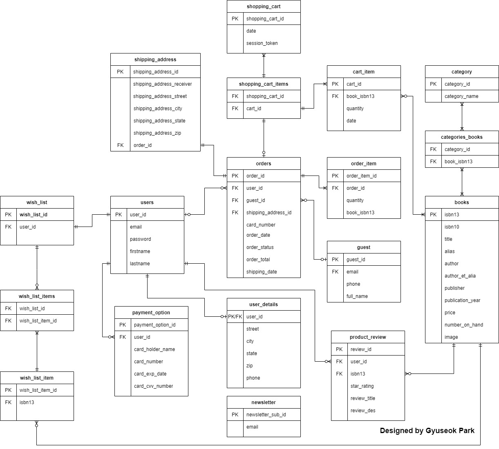
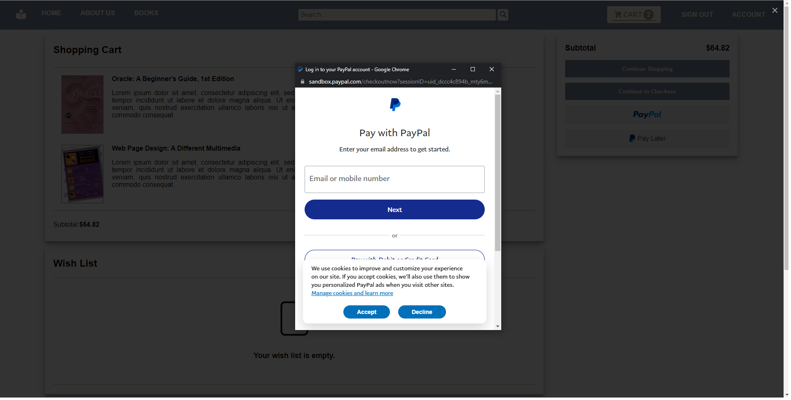

## Online Bookstore Project (Software Engineering Method)
Public DNS: http://ec2-3-137-184-44.us-east-2.compute.amazonaws.com 
(Not working right now because AWS free tier was expired)

## Group Members
- Frontend  
&nbsp;&nbsp;&nbsp;Raymond Lin  
&nbsp;&nbsp;&nbsp;Dimitrios Koloutsos  
- Backend  
&nbsp;&nbsp;&nbsp;Gyuseok Park  

## Tech Stacks
Frontend

Backend

## Architecture

## Database ERD

## CI/CD Pipeline
Free tier EC2 instance is halted when cleaning and installing our web app.  
It seems like it's because of a lack of RAM in the Free tier EC2 instance,  
so Jenkins's current job is to pull an image from a docker repository and to run it.

## screenshots

