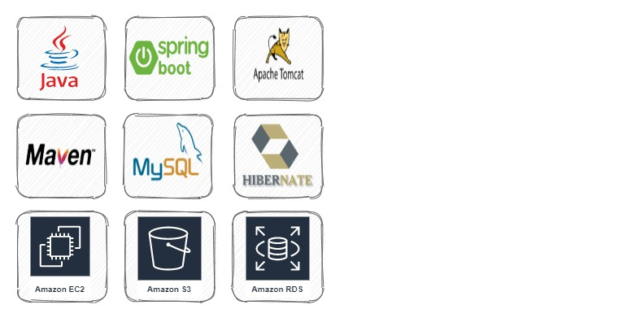
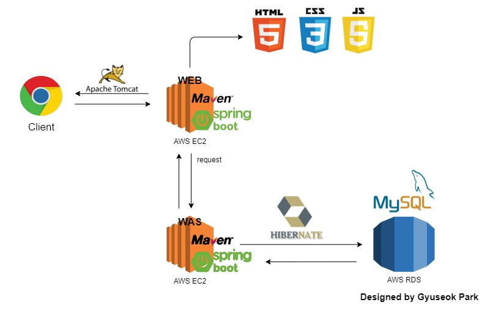

## Online Bookstore Project (Software Engineering Method)

## Group Members
- Raymond Lin
- Dimitrios Koloutsos
- Gyuseok Park

## Tech Stacks
Frontend

Backend

## Architecture

## Database ERD

## CI/CD Pipeline
Free tier EC2 instance is halted when cleaning and installing our web app.  
It seems like it's because of a lack of RAM in the Free tier EC2 instance.

